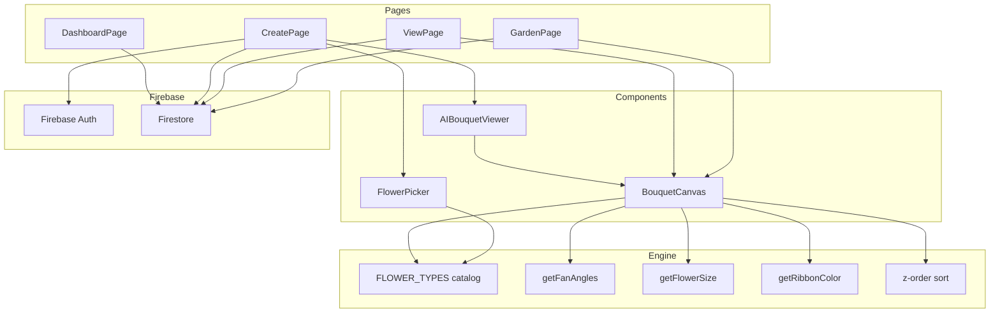

# Design Document — DevsBouquet Rebuild

## Overview

DevsBouquet is a romantic digital bouquet builder. The rebuild replaces the existing mixed rendering approach (SVG-drawn flowers + rough.js sketches) with a clean, image-based composition engine. Every flower is a botanical PNG illustration; the engine fans them around a single Tie_Point, draws a ribbon bow, and bundles the stems — producing a convincing hand-tied bouquet entirely in SVG.

The rebuild touches three layers:

1. **Composition engine** — pure layout math (fan angles, sizing, z-ordering, ribbon color)
2. **UI components** — BouquetCanvas (SVG renderer) and FlowerPicker (catalog grid)
3. **Application shell** — pages, routing, Firebase persistence, auth, demo mode

The existing Firebase integration, routing, and auth code are largely retained. The engine and the two primary components are replaced wholesale.

---

## Architecture



**Data flow on the Create page:**

```
User clicks Flower_Card
  → FlowerPicker calls onAddFlower({ type })
    → CreatePage appends to flowers[]
      → AIBouquetViewer receives new flowers[]
        → BouquetCanvas re-renders SVG immediately
```

**State is owned by CreatePage** and passed down as props. No global state store is needed — the bouquet composition is entirely derived from the `flowers` array.

---

## Components and Interfaces

### BouquetCanvas

```jsx
<BouquetCanvas flowers={FlowerInstance[]} />
```

**FlowerInstance:**
```ts
{ type: string }   // key into FLOWER_TYPES
```

Renders a self-contained `<svg viewBox="0 0 480 580">` with:

- A warm off-white `<rect>` background (`#faf8f3`)
- Stem bundle lines below Tie_Point
- Flower `<image>` elements, each wrapped in a `<g transform="rotate(angle, TIE_X, TIE_Y)">`
- Ribbon bow `<path>` group at Tie_Point

When `flowers` is empty, renders `null` (the parent `AIBouquetViewer` shows the placeholder instead).

**Canvas constants:**
```
W = 480, H = 580
TIE_X = 240, TIE_Y = 406  (H × 0.70)
```

### FlowerPicker

```jsx
<FlowerPicker
  onAddFlower={(flower: FlowerInstance) => void}
  selectedFlowers={FlowerInstance[]}
/>
```

Renders a 2-column CSS grid of `FlowerCard` buttons. Each card shows:
- The flower's PNG (``)
- Name in serif font
- Poetic tagline in italic
- Count badge (shown when count ≥ 1)
- Rose-gold border glow when selected

Clicking a card calls `onAddFlower` unless `selectedFlowers.length >= 12`.

### AIBouquetViewer

Thin wrapper around `BouquetCanvas` that handles the empty-state placeholder and Framer Motion entrance animation. No logic changes needed beyond ensuring it passes `flowers` through.

### FLOWER_TYPES catalog

Located at `src/engine/flowers/index.jsx`. The rebuild trims this to exactly the six real PNG assets:

```
classic_red_rose       → /assets/flowers/classic_red_rose.png
romantic_pink_peony    → /assets/flowers/romantic_pink_peony.png
vibrant_sunflower      → /assets/flowers/vibrant_sunflower.png
delicate_white_lily    → /assets/flowers/delicate_white_lily.png
textured_blue_hydrangea → /assets/flowers/textured_blue_hydrangea.png
cheerful_daisy         → /assets/flowers/cheerful_daisy.png
```

Each entry gains a `dominantColor` field used by `getRibbonColor`:

```ts
type FlowerDef = {
  name: string
  role: 'FOCAL' | 'FOUNDATION' | 'FILLER'
  image: string           // path under /public
  description: string
  poetic: string
  dominantColor: 'pink' | 'warm' | 'blue' | 'white'
}
```

---

## Data Models

### Bouquet (Firestore document)

```ts
interface Bouquet {
  id: string              // Firestore doc ID
  userId: string
  to: string
  from: string
  message: string
  occasion: OccasionKey
  flowers: FlowerInstance[]   // [{ type: string }, ...]
  isPublic: boolean
  seed: number
  createdAt: Timestamp | string
  viewed: boolean
  viewedAt: Timestamp | string | null
  reaction: string | null
}

type OccasionKey =
  | 'birthday' | 'thank-you' | 'love'
  | 'sympathy' | 'congrats' | 'just-because'
```

### Selection_State (in-memory, CreatePage)

```ts
type SelectionState = FlowerInstance[]   // ordered list, max 12 items
```

### FlowerInstance

```ts
interface FlowerInstance {
  type: string   // key into FLOWER_TYPES
}
```

---

## Correctness Properties

*A property is a characteristic or behavior that should hold true across all valid executions of a system — essentially, a formal statement about what the system should do. Properties serve as the bridge between human-readable specifications and machine-verifiable correctness guarantees.*

### Property 1: Fan angles are symmetric and bounded

*For any* flower count between 2 and 12, `getFanAngles(count)` shall return an array of length `count` where the values are symmetric around zero and the total arc (max − min) does not exceed 100 degrees.

**Validates: Requirements 3.5**

---

### Property 2: Flower size is monotonically non-increasing

*For any* two counts `n > m` where both are in the range [1, 12], `getFlowerSize(n) ≤ getFlowerSize(m)` — adding more flowers never makes individual flowers larger.

**Validates: Requirements 3.8**

---

### Property 3: Center flowers have higher z-order than outer flowers

*For any* flowers array of length ≥ 2, after z-order sorting, the flower whose index is closest to the center of the array shall appear later in the render order (higher z) than flowers at the outer indices.

**Validates: Requirements 3.9**

---

### Property 4: Flower card renders required fields for any catalog entry

*For any* flower definition in FLOWER_TYPES, rendering its FlowerCard shall produce output that contains the flower's name, an `` with the correct `/assets/flowers/` src, and the poetic tagline text.

**Validates: Requirements 2.2, 2.3**

---

### Property 5: Clicking a card always adds exactly one instance

*For any* flower type and any current Selection_State with fewer than 12 items, clicking that flower's card shall increase the count of that flower type in Selection_State by exactly 1.

**Validates: Requirements 2.4, 2.6**

---

### Property 6: Selection count never exceeds 12

*For any* sequence of flower card clicks, the total number of items in Selection_State shall never exceed 12, regardless of which cards are clicked or in what order.

**Validates: Requirements 2.8, 2.9**

---

### Property 7: Count badge reflects actual selection count

*For any* flower type with count `k` (1 ≤ k ≤ 12) in Selection_State, the badge rendered on that flower's card shall display the value `k`.

**Validates: Requirements 2.5**

---

### Property 8: Ribbon color is consistent with dominant flower color

*For any* flowers array, `getRibbonColor(flowers)` shall return a `{ fill, stroke }` object where the chosen color family corresponds to the most frequently occurring `dominantColor` among the input flowers.

**Validates: Requirements 3.7**

---

### Property 9: Randomized arrangement is always valid

*For any* invocation of the randomize function, the resulting Selection_State shall contain between 6 and 10 flower instances, and every instance's `type` shall be a key present in FLOWER_TYPES.

**Validates: Requirements 11.2, 11.3**

---

### Property 10: Garden filter returns only matching bouquets

*For any* array of bouquets and any occasion filter value, the filtered result shall contain only bouquets whose `occasion` field equals the filter value, and no bouquet with a different occasion shall appear in the result.

**Validates: Requirements 8.4, 8.5**

---

### Property 11: Dashboard statistics are consistent with bouquet data

*For any* array of user bouquets, the computed statistics (total sent, total viewed, total with reactions) shall equal the exact counts derived from the array — `total = array.length`, `viewed = array.filter(b => b.viewed).length`, `reactions = array.filter(b => b.reaction !== null).length`.

**Validates: Requirements 9.3**

---

## Error Handling

### Bouquet save failure
- The `handleSend` function in CreatePage wraps `createBouquet` in try/catch.
- On failure, an error message is displayed to the user (toast or inline alert). Navigation does not occur.
- The "Send Bouquet" button returns to its normal state after failure.

### Bouquet not found (View page)
- If `getBouquet(id)` returns `null`, the View page renders a graceful "not found" message with a link to `/create`.

### Firebase not configured (Demo Mode)
- `isFirebaseConfigured` is checked at startup. When false, all Firebase calls are replaced by in-memory operations in `bouquets.js`.
- A visible banner informs the user that data will not persist.
- Demo mode allows full bouquet creation, viewing, and sharing within the same browser session.

### Image load failure
- SVG `<image>` elements that fail to load render as empty space. The bouquet layout is unaffected.
- No explicit error handling is needed — the SVG gracefully degrades.

### Maximum flower limit
- FlowerPicker silently ignores clicks when `selectedFlowers.length >= 12`. No error message is shown; the card simply does not respond.

### Authentication redirect
- ProtectedRoute redirects unauthenticated users to `/login`, preserving the intended destination in router state for post-login redirect.

---

## Testing Strategy

### Dual approach

Unit tests cover specific examples, edge cases, and error conditions. Property tests verify universal invariants across many generated inputs. Both are needed — unit tests catch concrete bugs, property tests verify general correctness.

### Property-based testing library

**Vitest** (already compatible with the Vite setup) + **fast-check** for property-based testing.

```bash
npm install --save-dev vitest @testing-library/react @testing-library/jest-dom fast-check
```

Each property test runs a minimum of **100 iterations**. Tests are tagged with a comment referencing the design property:

```js
// Feature: devs-bouquet-rebuild, Property 1: Fan angles are symmetric and bounded
```

### Unit tests (example-based)

| Area | What to test |
|---|---|
| `getFanAngles(1)` | Returns `[0]` |
| `getFanAngles(0)` | Returns `[]` |
| `BouquetCanvas` empty | Renders `null` when `flowers=[]` |
| `BouquetCanvas` single | Renders one `<image>` at 0° rotation |
| `FlowerPicker` render | Shows exactly 6 cards |
| `FlowerPicker` selected state | `.selected` class applied when flower in selection |
| `getRibbonColor` tie | Returns neutral color when all dominantColors are equal |
| `createBouquet` demo mode | Returns a string ID and stores bouquet in memory |
| `getBouquet` not found | Returns `null` for unknown ID |
| Dashboard empty state | Renders empty-state CTA when bouquets array is empty |

### Property tests

Each property from the Correctness Properties section maps to one property-based test:

**Property 1 — Fan angles symmetric and bounded**
```js
// Feature: devs-bouquet-rebuild, Property 1: Fan angles are symmetric and bounded
fc.assert(fc.property(
  fc.integer({ min: 2, max: 12 }),
  (count) => {
    const angles = getFanAngles(count);
    assert(angles.length === count);
    const arc = Math.max(...angles) - Math.min(...angles);
    assert(arc <= 100 + 1e-9);
    // symmetry: sum of angles ≈ 0
    const sum = angles.reduce((a, b) => a + b, 0);
    assert(Math.abs(sum) < 1e-9);
  }
));
```

**Property 2 — Flower size monotonically non-increasing**
```js
// Feature: devs-bouquet-rebuild, Property 2: Flower size is monotonically non-increasing
fc.assert(fc.property(
  fc.integer({ min: 1, max: 11 }),
  (m) => {
    const n = m + 1;
    assert(getFlowerSize(n) <= getFlowerSize(m));
  }
));
```

**Property 3 — Center flowers have higher z-order**
```js
// Feature: devs-bouquet-rebuild, Property 3: Center flowers have higher z-order than outer flowers
fc.assert(fc.property(
  fc.array(fc.constantFrom(...Object.keys(FLOWER_TYPES)), { minLength: 2, maxLength: 12 }),
  (types) => {
    const flowers = types.map(t => ({ type: t }));
    const sorted = zOrderSort(flowers);
    const centerIdx = (flowers.length - 1) / 2;
    const centerRenderPos = sorted.findIndex(f => Math.abs(f.originalIndex - centerIdx) < 0.5);
    assert(centerRenderPos === sorted.length - 1);
  }
));
```

**Property 5 — Clicking a card adds exactly one instance**
```js
// Feature: devs-bouquet-rebuild, Property 5: Clicking a card always adds exactly one instance
fc.assert(fc.property(
  fc.constantFrom(...Object.keys(FLOWER_TYPES)),
  fc.array(fc.constantFrom(...Object.keys(FLOWER_TYPES)), { minLength: 0, maxLength: 11 }),
  (clickedType, existingTypes) => {
    const existing = existingTypes.map(t => ({ type: t }));
    const before = existing.filter(f => f.type === clickedType).length;
    const result = addFlower(existing, { type: clickedType });
    const after = result.filter(f => f.type === clickedType).length;
    assert(after === before + 1);
    assert(result.length === existing.length + 1);
  }
));
```

**Property 6 — Selection count never exceeds 12**
```js
// Feature: devs-bouquet-rebuild, Property 6: Selection count never exceeds 12
fc.assert(fc.property(
  fc.array(fc.constantFrom(...Object.keys(FLOWER_TYPES)), { minLength: 1, maxLength: 20 }),
  (clickSequence) => {
    let state = [];
    for (const type of clickSequence) {
      if (state.length < 12) state = [...state, { type }];
    }
    assert(state.length <= 12);
  }
));
```

**Property 7 — Count badge reflects actual count**
```js
// Feature: devs-bouquet-rebuild, Property 7: Count badge reflects actual selection count
fc.assert(fc.property(
  fc.constantFrom(...Object.keys(FLOWER_TYPES)),
  fc.integer({ min: 1, max: 12 }),
  (flowerType, count) => {
    const selection = Array.from({ length: count }, () => ({ type: flowerType }));
    const { getByText } = render(<FlowerPicker selectedFlowers={selection} onAddFlower={() => {}} />);
    expect(getByText(String(count))).toBeInTheDocument();
  }
));
```

**Property 8 — Ribbon color consistent with dominant color**
```js
// Feature: devs-bouquet-rebuild, Property 8: Ribbon color is consistent with dominant flower color
fc.assert(fc.property(
  fc.array(fc.constantFrom('pink', 'warm', 'blue', 'white'), { minLength: 1, maxLength: 12 }),
  (dominantColors) => {
    const flowers = dominantColors.map(c => ({ type: colorToFlowerType(c) }));
    const ribbon = getRibbonColor(flowers);
    const dominant = mostFrequent(dominantColors);
    assert(ribbonMatchesDominant(ribbon, dominant));
  }
));
```

**Property 9 — Randomized arrangement is always valid**
```js
// Feature: devs-bouquet-rebuild, Property 9: Randomized arrangement is always valid
fc.assert(fc.property(
  fc.integer({ min: 0, max: 999999 }),
  (seed) => {
    const result = randomizeArrangement(seed);
    assert(result.length >= 6 && result.length <= 10);
    result.forEach(f => assert(f.type in FLOWER_TYPES));
  }
));
```

**Property 10 — Garden filter returns only matching bouquets**
```js
// Feature: devs-bouquet-rebuild, Property 10: Garden filter returns only matching bouquets
fc.assert(fc.property(
  fc.array(bouquetArbitrary, { minLength: 0, maxLength: 30 }),
  fc.constantFrom('birthday', 'thank-you', 'love', 'sympathy', 'congrats', 'just-because'),
  (bouquets, filter) => {
    const result = filterByOccasion(bouquets, filter);
    result.forEach(b => assert(b.occasion === filter));
  }
));
```

**Property 11 — Dashboard statistics consistent with data**
```js
// Feature: devs-bouquet-rebuild, Property 11: Dashboard statistics are consistent with bouquet data
fc.assert(fc.property(
  fc.array(bouquetArbitrary, { minLength: 0, maxLength: 50 }),
  (bouquets) => {
    const stats = computeStats(bouquets);
    assert(stats.total === bouquets.length);
    assert(stats.viewed === bouquets.filter(b => b.viewed).length);
    assert(stats.reactions === bouquets.filter(b => b.reaction !== null).length);
  }
));
```

### Integration tests

| Scenario | Approach |
|---|---|
| Bouquet save → fetch round trip | Firebase emulator or mock |
| View page marks bouquet as viewed | Mock Firestore, verify `updateDoc` called |
| Auth redirect for protected routes | Mock `useAuth`, verify navigation |
| Demo mode bouquet persistence | No Firebase config, full create/view flow |
| Garden loads public bouquets | Mock `getPublicBouquets`, verify cards rendered |

### Test file structure

```
src/
  __tests__/
    engine/
      fanAngles.test.js       # Properties 1, 2
      zOrder.test.js          # Property 3
      ribbonColor.test.js     # Property 8
      randomizer.test.js      # Property 9
    components/
      FlowerPicker.test.jsx   # Properties 4, 5, 6, 7
      BouquetCanvas.test.jsx  # Unit tests for canvas rendering
    pages/
      GardenPage.test.jsx     # Property 10
      DashboardPage.test.jsx  # Property 11
    firebase/
      bouquets.test.js        # Integration tests
```
